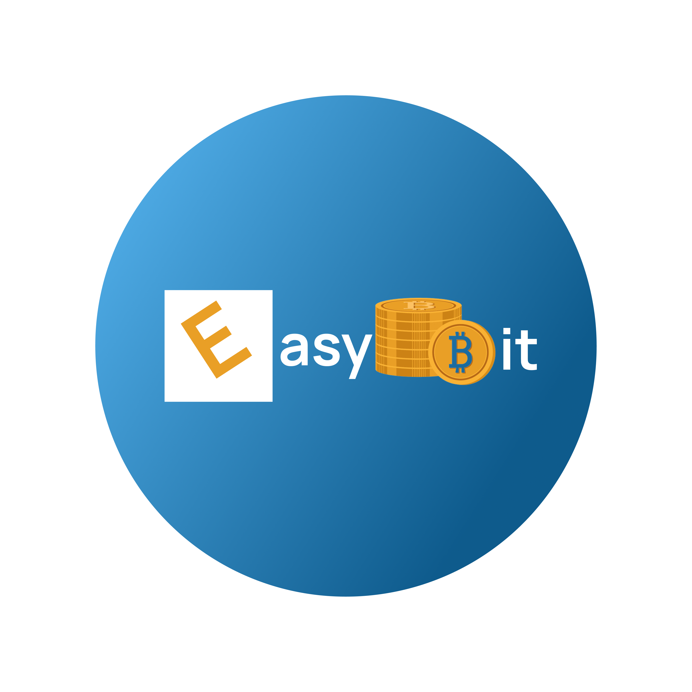

 

# Description

EasyBit est un projet novateur visant à créer une application mobile permettant d'acheter des Bitcoins (BTC) avec de la monnaie locale (XOF) via des services de mobile money tels que Wave et Orange Money. De plus, l'application offre la possibilité de convertir des Bitcoins en monnaies locales en utilisant les mêmes services. Cette solution offre une passerelle transparente et fiable entre la crypto-monnaie et les systèmes de paiement mobile, simplifiant ainsi les transactions financières pour les utilisateurs sénégalais.Cette initiative révolutionne l'accès aux crypto-monnaies en facilitant l’accès à ces technologies. 
 
# Fonctionnalités principales

**Achat de bitcoin avec de la monnaie locale** : EasyBitoffre aux utilisateurs la possibilité d'acheter des bitcoins grâce à une intégration avec divers services de mobile money, les transactions deviennent faciles. 
 
**Conversion de bitcoin en monnaie locale**: La plateforme permet également de convertir sesbitcoins en monnaie locale, offrant ainsi une flexibilité financière. 
 
**Calculateur de changebitcoin - Franc CFA** : EasyBit permet aux utilisateurs de calculerla valeur en franc CFA à partir d’un montant bitcoin renseigné et inversement. Et ce, en utilisant le taux de change du bitcoin mis à jour en temps réel. 
 
**Alerte de Taux de Change** : La fonctionnalité d'alerte de taux de change dans EasyBit offre une surveillance des fluctuations du marché en alertant les utilisateurs lorsque le taux de change bitcoin - Franc CFA atteint un seuil prédéfini. Cette fonction permet aux utilisateurs de rester informés en temps réel et de prendre des décisions éclairées sur leurs transactions. 
 
 
# Technologies utilisées 

<u>**Python - Django**</u> :
Le choix de Python par rapport à d'autres langages de programmation utilisés dans le backend, tels que Java, PHP, etc., est très pertinent. Python est un langage de programmation qui offre de nombreuses bibliothèques pour la manipulation des données. Dans notre cas, Django est le framework choisi, en raison de sa robustesse et de sa sécurité. Django, étant un framework complet pour construire des applications web en Python, offre des fonctionnalités telles que l'authentification, la gestion des bases de données, l'administration, etc. Il est particulièrement adapté pour les projets de grande envergure nécessitant une gestion efficace des utilisateurs et des données.

 
<u>**Flutter**</u> :
Pour la partie frontend, Flutter est le framework utilisé. Flutter est un framework open source permettant de créer des applications mobiles de haute qualité et hautes performances sur les systèmes d'exploitation mobiles. Son interface est basée sur des widgets réutilisables et fortement composable. Flutter fournit des widgets de composants Material Design et Cupertino pour les applications centrées sur Android ou iOS. La fonctionnalité de rechargement à chaud permet des mises à jour en temps réel, améliorant le processus de développement. 
 
<u>**SQLite**</u> :
SQLite est une base de données très légère qui offre de bonnes performances. De plus il est fiable :il met à jour votre contenu en permanence, de sorte que peu ou pas de travail est perdu en cas de panne de courant ou de panne.
 
# Environnement de travail

Pour exécuter notre application vous avez besoin d’installer 

## Frontend: 
 
**Android Studio** : 

Cliquez sur ce [lien](https://developer.android.com/studio) pour télécharger android studio, puis vous pouvez suivre les instructions d’installation en vous rendant sur ce [lien](https://developer.android.com/studio/install?hl=fr) :

Ensuite, créez l’émulateur pour pouvoir exécuter l’application. Vous pouvez suivre ce [lien](https://developer.android.com/studio/run/emulator?hl=fr) pour plus d'informations.

Enfin, installez Flutter en cliquant [ici](https://docs.flutter.dev/get-started/install). 
  
 
## Backend :

**Python** :

Suivez ce [lien](https://www.python.org/downloads/) pour installer python.
Pour ajouter toutes les dépendances, placez-vous dans la racine du projet et taper la commande suivante:

 `pip install -r requirements.txt` 